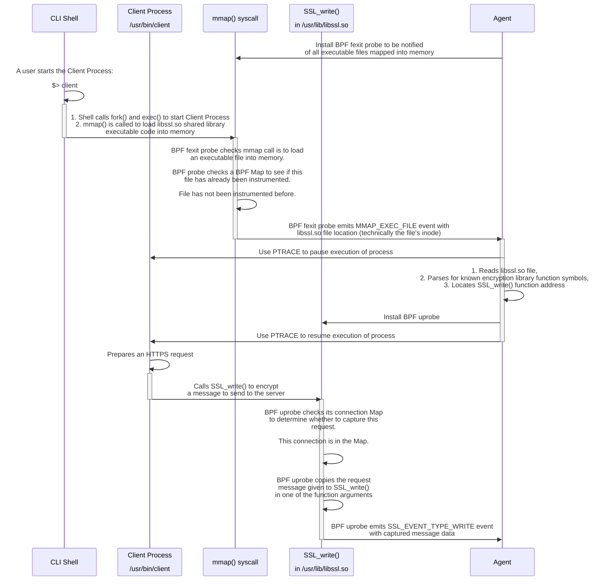
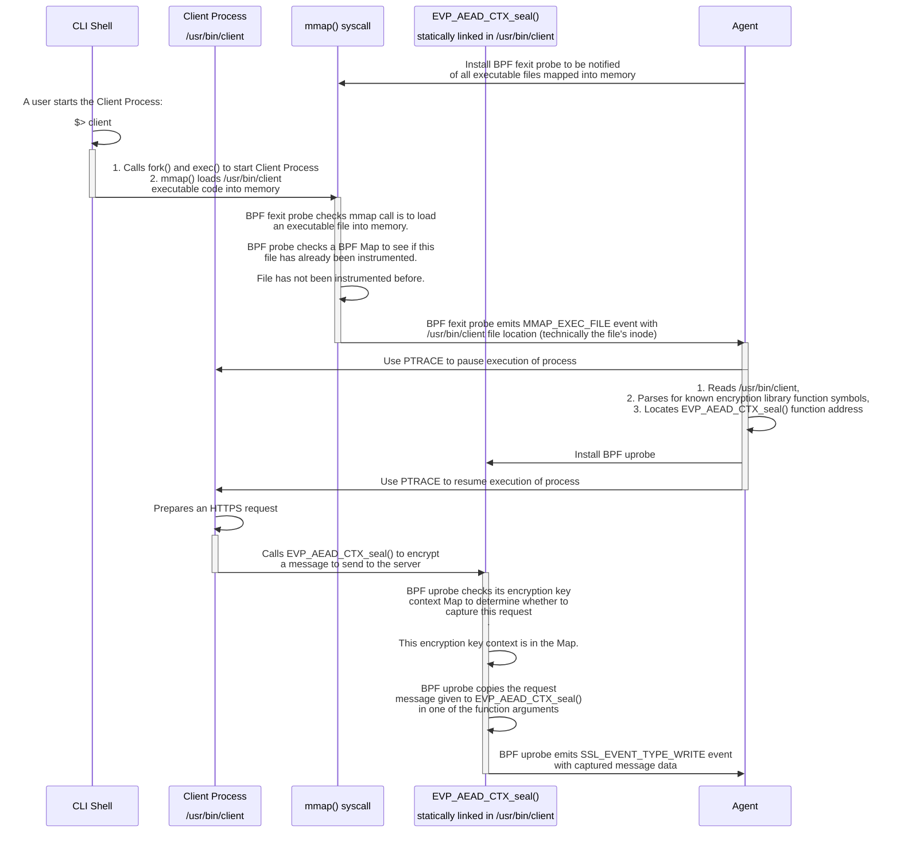
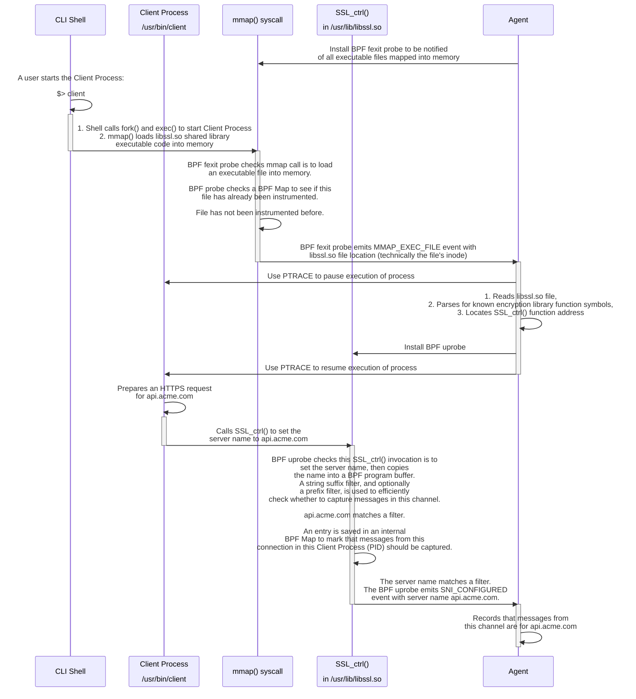
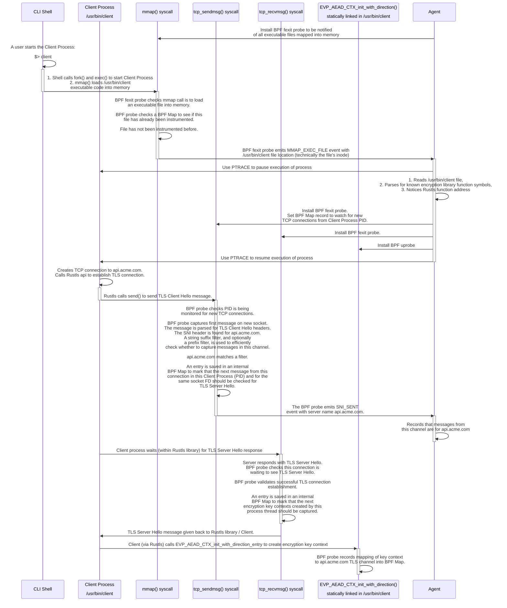

# Technical Details

> Note: Many details described in this document are patented or patent-pending technology.

## BPF-Level Instrumentation

To make it easier to follow along, the first half of this _BPF-Level Instrumentation_ section of the document covers the
algorithms for instrumenting and capturing encrypted messages **after** TLS Server Name (hostname) filtering has taken
place. The second half of this section describes the hostname filtering that takes place when connections are
established, which is more involved and adds on top of concepts from the first section.

The examples cover two illustrative use cases:

- A program that links to OpenSSL's libssl.so shared library at runtime
- A Rust program that statically links Rustls encryption library code into the executable file

There are other libraries that could be linked as shared libraries in place of OpenSSL, but the general techniques
described below for instrumentation is the same. Examples include swapping OpenSSL for BoringSSL, GnuTLS, or AWS-LC
shared libraries.

Similarly, there are other runtimes and libraries that could statically be linked into programs, but the general
approach described below is the same. Examples include using the Ring library in a Rust program, GoTLS in a Go program,
or statically compiling OpenSSL (and similar) libraries into a program.

### Capturing Encrypted Messages

#### Shared Encryption Library Function Example

`SSL_write()` is a function available from the OpenSSL Project's `libssl` library. For this example we will assume there
is a client program written as a PHP application that links against the shared libssl.so library file at runtime.

The following sequence shows how the client process is instrumented so that when it prepares a request to be encrypted
and sent to a server, the instrumenation can capture the message. This sequence only covers how the instrumentation
captures data that will be encrypted for a request message, but the mechanism can be roughly reversed to capture the
response from the server after it has been decrypted.

The agent can continuously monitor and instrument new processes as they run on the system. When the PHP executable file
is loaded it only contains base PHP code. There is nothing to instrument yet. At some point, the PHP code will use the
shared library system to further load the `libssl.so` library file. This means simply watching processes start is not
enough to instrument them. We must wait until they have loaded a file with encryption code.

Every time a new executable file is loaded (mmap'ed) into memory, we need to check whether it has encryption library
code. To make sure we don't miss any messages, we use PTRACE to pause execution of the program while we check the loaded
file. While a small race condition window exists, most processes do not have time to instantiate encrypted channels
before the process is paused. In fact, the agent has a tiny POSIX thread dedicated just to receiving Mmap events and
immediately pausing processes to reduce this critical race condition window. Other agent threads are used to parse and
instrument executable files. Although parsing an executable file looking for encryption library code to instrument is
expensive, the BPF mmap probe maintains a [BPF Map](https://docs.kernel.org/bpf/maps.html) (i.e. an area of storage that
can be used by a BPF probe across invocations) of records of previously evaluated executable files so each file is only
ever parsed and instrumented once.

#### Static Encryption Library Function Example

`EVP_AEAD_CTX_seal()` is a function in a publicly available
[FIPS](https://csrc.nist.rip/groups/STM/cmvp/validation.html) module library (e.g. from BoringSSL and AWS-LC FIPS
modules). In this example, a client process is written in Rust using the Rustls encryption library. Rustls is a wrapper
library making it easy to use FIPS modules within Rust applications. The client has Rustls and the FIPS module
statically linked into its executable code file.

The only difference is that in this instance the encryption code is statically linked into the program executable file,
so the function is found in the initial program file load rather than a later load of a separate shared library file.

### Filtering Captures Based On TLS Server Name

If we captured all encrypted traffic on a server via BPF and sent it to the _Agent_ we would likely overload the
utilization of the server. This instrumentation system has multiple layers of filtering to prevent an overload of
utilization from happening. The following sequences show how this filtering occurs for a few different types of
encryption libraries.

In the following cases we are the client which is establishing a new TLS encrypted channel to a server. The client
application sets the expected server name (e.g. `api.acme.com`) in a TLS Server Name Indication (SNI) extension of the
TLS Client Hello message when establishing the new encrypted channel. The server then uses the server name to route
messages and respond with a matching SSL certificate (e.g. it might use the `*.acme.com` certificate if the client
begins an encrypted channel for `api.acme.com`).

#### OpenSSL / libssl.so as a Shared Library

When connecting to a server via OpenSSL the client application calls `SSL_ctrl()` to set the server name.

This sequence begins by observing and instrumenting encryption functions as executable code is loaded.

#### Rust Application Using Statically Linked Rustls Library

When connecting to a server via Rustls the client application calls Rustls functions to set the server name. Rustls uses
a FIPS module library to perform encryption. Unfortunately, Rust does not have a stable ABI, meaning that although we
can get the addresses of Rustls functions and attach to them, we don't know at runtime how arguments are passed (i.e.
which register or stack position they are at). Instead, we attach probes to TCP sendmsg and recvmsg syscalls to parse
TLS Hello messages and to the FIPS module library symbols that perform the raw encryption/decryption of data.

This sequence begins by observing and instrumenting encryption functions as executable code is loaded. Then:

1. We parse TLS headers in BPF code to capture the hostname
2. We use multiple pieces of contextual information (Process / Thread IDs, Socket File Descriptors, and Encryption Keys
   / Key Contexts) to track the encryption channels across TCP syscalls and encryption library calls

The encryption key context values that are tracked vary by encryption library. In some cases the key context can be the
address of a structure in memory that contains data about the key used for the channel. In other cases (e.g. the Rust
Ring library), the key context can be the value of the first X-bytes of the pseudo-random key material (e.g. the first
8-bytes of key material), which should have sufficient entropy to practically guarantee the ability to map from the key
context value to the TLS connection it is used for to encrypt or decrypt messages.

By analyzing encryption library code we can determine the order of thread execution and syscall / library function
calls. We have determined through this analysis that calls into the FIPS module to create encryption key contexts are
performed on the same process thread immediately after TLS Server Hello messages are received. Thus, we can capture and
record that a given key context maps to a given TLS connection.

